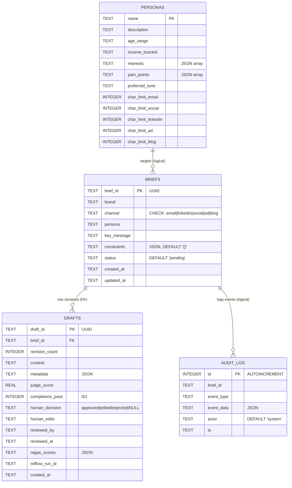
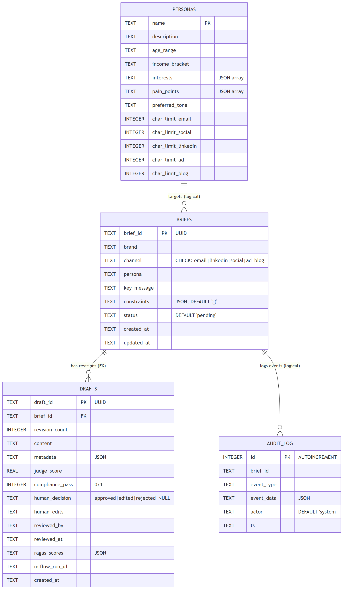
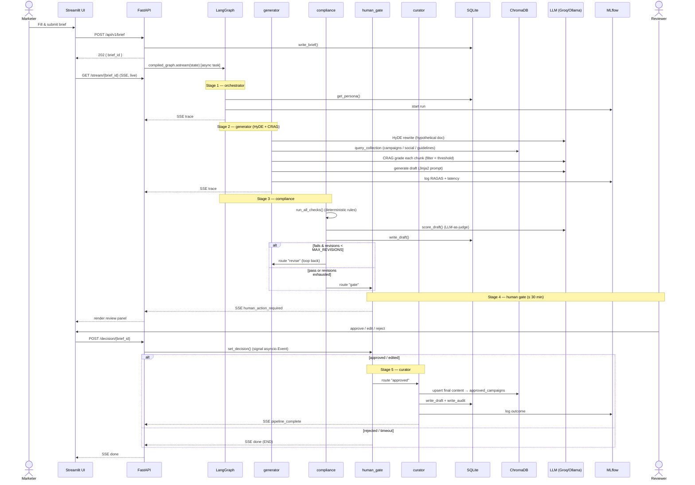
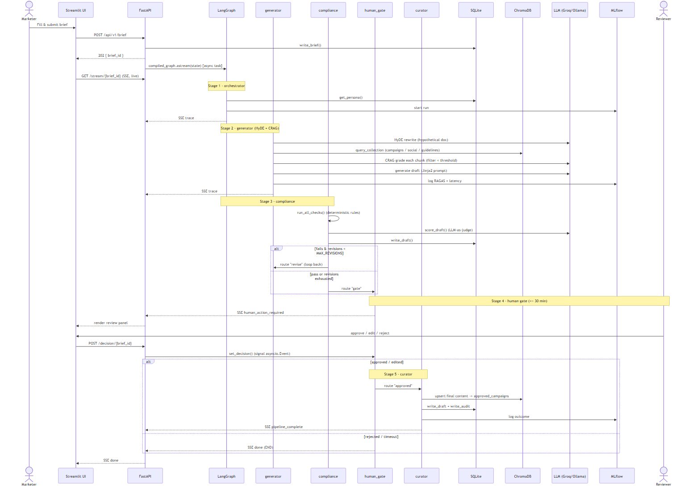

# CraftAI — Marketing Content Agent: Codebase Documentation

> Verified against source on 2026-07-07. This is the single, authoritative codebase reference.

---

## 1. System Overview

**CraftAI** is a multi-agent "marketing content supply chain". A marketer submits a short
campaign **brief** (brand, channel, persona, key message); the system autonomously drafts,
compliance-checks, routes for human approval, and re-indexes the approved content back into
its knowledge base — closing a learning loop.

**Pipeline (LangGraph state machine):**

```
START → orchestrator → generator → compliance ─(revise)→ generator
                                        │
                                     (gate)
                                        ▼
                                   human_gate ─(approved/edited)→ curator → END
                                        └────────(rejected)──────────────→ END
```

| Layer | Technology |
|---|---|
| Agent framework | LangGraph (typed `AgentState` state machine) |
| LLM providers | Groq (cloud, default) / Ollama (local) — switchable at runtime |
| Vector DB | ChromaDB (persistent, 3 collections, cosine distance) |
| Relational DB | SQLite (WAL mode) |
| Embeddings | SentenceTransformer `all-MiniLM-L6-v2` |
| RAG strategy | HyDE (query rewrite) + CRAG (self-grading) |
| Evaluation | RAGAS |
| Observability | MLflow (SQLite backend) |
| API | FastAPI + SSE-Starlette |
| UI | Streamlit |

---

## 2. Kind of LLM Used

### Chat / generation models (pluggable)
Selected by env var `LLM_PROVIDER` and instantiated by the `get_llm(temperature)` factory in `config.py`,
which returns a LangChain `BaseChatModel`.

| Provider | SDK | Default model | Config keys |
|---|---|---|---|
| **Groq** (default) | `langchain-groq` → `ChatGroq` | `llama3-70b-8192` | `GROQ_API_KEY`, `GROQ_MODEL` |
| **Ollama** (local) | `langchain-ollama` → `ChatOllama` | `llama3` | `OLLAMA_BASE_URL`, `OLLAMA_MODEL` |

**Where the LLM is called** (all via the same `get_llm` model):
- **HyDE rewrite** — writes a hypothetical ideal snippet for the brief (`rag/retriever.py`).
- **CRAG grading** — scores each retrieved chunk's relevance 0.0–1.0 (`rag/retriever.py`).
- **Draft generation** — temperature `0.8` on first pass, `0.5` on revisions (`graph/nodes/generator.py`).
- **LLM-as-judge** — few-shot compliance scorer returning `(score, evidence)` (`compliance/judge.py`).

### Embedding model
`all-MiniLM-L6-v2` via SentenceTransformers — used for RAG retrieval, document indexing, and semantic search.

### Evaluation
RAGAS metrics per draft: `faithfulness`, `answer_relevancy`, `context_precision`, `context_recall`.

---

## 3. Database Storage

Three separate stores under `data/` (git-ignored, runtime-generated):

| File | Store type | Purpose |
|---|---|---|
| `data/craftai.db` | SQLite (WAL) | Application data: briefs, drafts, audit log, personas |
| `data/chroma/chroma.sqlite3` + binary index dirs | ChromaDB | Vector embeddings (3 collections) |
| `data/mlflow.db` | SQLite | MLflow experiment tracking backend |

### 3.1 SQLite application schema (`db/migrations/001_init.sql`)

Connection opens with `PRAGMA journal_mode=WAL` and `PRAGMA foreign_keys=ON` (`db/sqlite.py._connect`).

**`briefs`** — one row per submitted campaign brief
| Column | Type | Notes |
|---|---|---|
| `brief_id` | TEXT PK | UUID |
| `brand` | TEXT NOT NULL | |
| `channel` | TEXT NOT NULL | CHECK ∈ `email\|linkedin\|social\|ad\|blog` |
| `persona` | TEXT NOT NULL | |
| `key_message` | TEXT NOT NULL | |
| `constraints` | TEXT NOT NULL DEFAULT `'{}'` | JSON blob |
| `status` | TEXT NOT NULL DEFAULT `'pending'` | |
| `created_at` / `updated_at` | TEXT DEFAULT `datetime('now')` | ISO datetime |

**`drafts`** — one row per generated/revised draft (FK → `briefs.brief_id`)
| Column | Type | Notes |
|---|---|---|
| `draft_id` | TEXT PK | UUID |
| `brief_id` | TEXT NOT NULL REFERENCES briefs | |
| `revision_count` | INTEGER NOT NULL DEFAULT 0 | |
| `content` | TEXT NOT NULL | Generated draft text |
| `metadata` | TEXT NOT NULL DEFAULT `'{}'` | JSON blob |
| `judge_score` | REAL | LLM judge score 0–1 |
| `compliance_pass` | INTEGER NOT NULL DEFAULT 0 | 0/1 boolean |
| `human_decision` | TEXT | CHECK ∈ `approved\|edited\|rejected` or NULL |
| `human_edits` | TEXT | Reviewer's revised text |
| `reviewed_by` | TEXT | |
| `reviewed_at` | TEXT | |
| `ragas_scores` | TEXT NOT NULL DEFAULT `'{}'` | JSON blob of RAGAS metrics |
| `mlflow_run_id` | TEXT | |
| `created_at` | TEXT DEFAULT `datetime('now')` | |

**`audit_log`** — append-only event trail
| Column | Type | Notes |
|---|---|---|
| `id` | INTEGER PK AUTOINCREMENT | |
| `brief_id` | TEXT NOT NULL | |
| `event_type` | TEXT NOT NULL | |
| `event_data` | TEXT NOT NULL DEFAULT `'{}'` | JSON blob |
| `actor` | TEXT NOT NULL DEFAULT `'system'` | |
| `ts` | TEXT DEFAULT `datetime('now')` | |

**`personas`** — audience definitions with per-channel char limits
| Column | Type | Default |
|---|---|---|
| `name` | TEXT PK | |
| `description` | TEXT NOT NULL | |
| `age_range` | TEXT | `'25-45'` |
| `income_bracket` | TEXT | `'middle'` |
| `interests` | TEXT | `'[]'` (JSON array) |
| `pain_points` | TEXT | `'[]'` (JSON array) |
| `preferred_tone` | TEXT | `'professional'` |
| `char_limit_email/social/linkedin/ad/blog` | INTEGER | 500 / 280 / 700 / 150 / 2000 |

**Indexes:** `idx_drafts_brief_id`, `idx_audit_brief_id`, `idx_briefs_status`

**Seeded personas** (with their own per-channel limits): Budget-Conscious, Premium Buyer,
Family Planner, Young Professional.

### 3.2 ChromaDB collections (cosine distance)
| Collection | Contents |
|---|---|
| `approved_campaigns` | Previously approved drafts, reused as generation examples (curator writes here) |
| `social_content` | Social post examples |
| `brand_guidelines` | Brand rules / compliance reference docs |

Chunking: `RecursiveCharacterTextSplitter` — 512 chars / 64 overlap for uploads; 256 for curator.
Per-chunk metadata: `brand`, `channel`, `source_filename`, `doc_base_id`.

### 3.3 Entity Relationship Diagram (SQLite)

Only `drafts.brief_id → briefs.brief_id` is an enforced foreign key. The other links are
**logical only** (no DB-level FK constraint): `audit_log.brief_id` and `briefs.persona → personas.name`.



**Rendered:**



---

## 4. File & Function Reference

### Root
| File | What it does |
|---|---|
| `main.py` | Console launcher. Helpers `_c/info/ok/warn/err/banner`; `check_env()` validates `.env`; `seed_if_needed()` seeds DB on first run; `_stream()` colors subprocess logs; `start(api_only)` / `watch()` launch & supervise FastAPI + Streamlit; `_shutdown()` graceful stop; `main()` CLI entry (`--api-only`, `--skip-seed`). |
| `config.py` | `Settings(BaseSettings)` (env-driven config); `_ensure_data_dirs` validator creates data dirs; `allowed_origins` property parses CORS list; `get_settings()` LRU singleton; **`get_llm(temperature=0.7)`** factory returns `ChatGroq` or `ChatOllama`. |
| `requirements.txt` | Python deps (LangGraph/LangChain, FastAPI, ChromaDB, sentence-transformers, RAGAS, MLflow, Streamlit, etc.). |
| `Makefile` | `dev/api/ui/index/cluster/test/lint/clean` targets. |
| `Dockerfile`, `scripts/reindex_chroma.py`, `ui/components/trace.py`, `ui/app.ppy` | **Placeholders / non-executed.** |
| `pytest.ini` | Pytest asyncio auto mode. |

### `graph/` — LangGraph pipeline
| File | Functions |
|---|---|
| `state.py` | `AgentState(TypedDict, total=False)` — shared state: identity, RAG context, generation, compliance, human-gate, curator, evaluation, orchestration fields. |
| `builder.py` | `build_graph()` assembles 5 nodes + conditional edges (compliance→revise/gate, human_gate→approved/rejected), returns compiled graph; `compiled_graph` module-level instance. |
| `nodes/orchestrator.py` | `orchestrator_node()` — Stage 1: validate brief, load/create persona from SQLite, open MLflow run, build 3-step plan, emit SSE. |
| `nodes/generator.py` | `generator_node()` — Stage 2: HyDE+CRAG retrieval (campaigns always; social if channel=social; guidelines if present), render Jinja2 template, LLM invoke (temp 0.8/0.5), RAGAS eval, MLflow log. `_parse_draft_json()` extracts JSON body (`body`/`copy`/`content`) with raw-text fallback. |
| `nodes/compliance.py` | `compliance_node()` — Stage 3: deterministic `run_all_checks()` + LLM `score_draft()`, sets `compliance_pass`, persists draft, MLflow log. `route()` → `"revise"` if failing & under `MAX_REVISIONS` else `"gate"`. |
| `nodes/human_gate.py` | `human_gate_node()` — Stage 4: creates `asyncio.Event`, emits `human_action_required`, awaits up to 30 min (auto-reject on timeout). `set_decision()` unblocks from the decision API. `route()` → `approved`/`rejected`. Module dicts `_events`, `_decisions`. |
| `nodes/curator.py` | `curator_node()` — Stage 5: use human edits or draft, chunk (256), embed, upsert to `approved_campaigns`, write draft+audit, MLflow log, emit `pipeline_complete`. |

### `rag/` — Retrieval-Augmented Generation
| File | Functions |
|---|---|
| `chroma_client.py` | `get_client()` (singleton PersistentClient), `get_collection()`, `init_collections()`, `upsert_documents()`, `query_collection()`, `collection_count()`. Constants `BRAND_GUIDELINES`, `APPROVED_CAMPAIGNS`, `SOCIAL_CONTENT`. |
| `embedder.py` | `get_model()` lazy thread-safe singleton; `encode(texts, batch_size=64)`; `encode_single(text)`. |
| `retriever.py` | `hyde_rewrite()` (LLM writes hypothetical doc); `crag_grade()` (LLM relevance 0–1, defaults 0.0 on parse fail); `retrieve()` (embed→NN search, converts distance to cosine sim); `retrieve_with_hyde()` (full HyDE→retrieve→CRAG filter→sort). |
| `evaluator.py` | `evaluate_ragas()` returns faithfulness/answer_relevancy/context_precision/context_recall; `_zero_scores()` fallback. |

### `compliance/` — Brand compliance engine
| File | Functions |
|---|---|
| `tools.py` | Deterministic (no LLM): `check_restricted_words`, `check_char_limits`, `check_required_phrases`, `check_url_format`, `run_all_checks`. Constants `_GLOBAL_RESTRICTED`, `_CHANNEL_RESTRICTED`, `_CHAR_LIMITS`. |
| `judge.py` | `score_draft()` — few-shot LLM-as-judge; system prompt + examples; returns `(score, evidence)` clamped to [0,1]; `(0.0, "parse error")` on failure. |

### `db/` — Persistence
| File | Functions |
|---|---|
| `sqlite.py` | `_connect()` (WAL + FK), `create_tables()`, `write_brief()`, `update_brief_status()`, `get_brief()`, `write_draft()`, `get_latest_draft()`, `write_audit()`, `get_personas()`, `get_persona()`. |
| `migrations/001_init.sql` | DDL for 4 tables + seed personas + indexes (see §3.1). |

### `api/` — FastAPI backend
| File | Functions |
|---|---|
| `main.py` | `lifespan()` — startup inits task/queue state, SQLite tables, ChromaDB, MLflow; shutdown cancels tasks. CORS + router mounts. |
| `routers/brief.py` | `submit_brief()` (UUID, persist, SSE queue, spawn graph task, 202); `_run_graph()` streams `compiled_graph.astream()` → SSE queue. |
| `routers/status.py` | `get_status()` — brief + latest draft snapshot. |
| `routers/decision.py` | `post_decision()` — validate, call `set_decision()` to unblock gate, write audit. |
| `routers/stream.py` | `stream_events()` — SSE drain of queue (trace / human_action_required / pipeline_complete / error / done); 30s heartbeat. |
| `routers/search.py` | `semantic_search()` — embed query, NN search, cosine-sim results. |
| `routers/ingest.py` | `_extract_text()` (PDF/DOCX/TXT/MD/CSV/JSON), `_chunk_text()` (512/64), `ingest_document()`, `ingest_list()`, `ingest_delete()`. |
| `routers/config.py` | `_read_env`/`_write_env`/`_reload_settings`; `get_config`, `set_config`, `test_connection`, `get_groq_models`, `get_embedding_models`, `get_ollama_models`. |
| `routers/audit.py` | `get_audit_events`, `get_briefs`, `get_drafts`, `get_audit_stats`, `get_event_types`. |
| `schemas/brief.py` | `BriefPayload`, `BriefResponse` (Pydantic). |
| `schemas/decision.py` | `DecisionPayload`, `SearchRequest`, `SearchResult`, `SearchResponse`. |

### `ui/` — Streamlit frontend
| File | Purpose |
|---|---|
| `app.py` | 4-tab app: CSS injection, header, LLM Config / Upload / Content Studio / Audit. |
| `pages/creator.py` | Brief form + live 7-step SSE tracker + inline review panel. `Step` dataclass; `_fresh_steps`, `_step_html`, `_render_all`, `_update_steps`, `_render_review_panel`, `_submit_decision`, `render`. |
| `pages/reviewer.py` | Standalone brief lookup + approve/edit/reject. |
| `pages/audit.py` | Briefs / Drafts / Events dashboard. |
| `pages/upload.py` | Document ingestion + collection browser + delete. |
| `pages/search.py` | Knowledge-base semantic search. |
| `pages/settings.py` | Provider/model selection, thresholds, test/save config. |

### `prompts/` — Jinja2 templates (one per channel)
`email.j2`, `linkedin.j2`, `social.j2`, `ad.j2`, `blog.j2` — rendered per run with brand, persona
profile, key message, retrieved RAG context, revision history, and prior rule violations.

### `scripts/` — Seeding / maintenance
| File | Purpose |
|---|---|
| `init_chroma.py` | `seed_campaigns` (8 examples), `seed_social_content` (5), `main` (create tables + init Chroma + seed). |
| `generate_guidelines.py` | `seed_guidelines` (8 brand-guideline docs). |
| `cluster_personas.py` | `cluster_personas(n_clusters=4)` — K-Means + PCA over campaign embeddings → JSON report. |
| `reindex_chroma.py` | Placeholder for re-embed after model change. |

### `tests/`
`conftest.py` (isolated test DB/Chroma/MLflow), `test_compliance.py`, `test_graph.py`, `test_ragas.py`.

---

## 5. API Endpoints (base `/api/v1`)

| Method | Path | Description |
|---|---|---|
| GET | `/health` | Liveness |
| POST | `/brief` | Submit brief → 202, starts pipeline |
| GET | `/status/{brief_id}` | Latest draft + compliance/RAGAS |
| POST | `/decision/{brief_id}` | Human decision (approved/edited/rejected) |
| GET | `/stream/{brief_id}` | SSE live trace |
| POST | `/search` | Semantic search over a collection |
| POST | `/ingest` | Upload + embed document (201) |
| GET | `/ingest/{collection}` | Collection stats + sample |
| DELETE | `/ingest/{collection}/{doc_id}` | Delete document chunks |
| GET/POST | `/config` | Read / persist LLM config |
| GET | `/config/groq/models`, `/config/ollama/models`, `/config/embedding/models` | Model lists |
| POST | `/config/test` | Test LLM connection (latency + preview) |
| GET | `/audit/events`, `/audit/briefs`, `/audit/drafts`, `/audit/stats`, `/audit/event-types` | Audit & analytics |

---

## 6. Key Configuration (env / thresholds)
`JUDGE_THRESHOLD=0.7` (min judge score to pass), `CRAG_THRESHOLD=0.5` (min chunk relevance),
`MAX_REVISIONS=3` (generate↔comply loops), `API_PORT=8000`, `UI_PORT=8501`.

---

## 7. End-to-End Pipeline Flow

1. **UI → `POST /api/v1/brief`** persists the brief and launches `compiled_graph.astream(state)` as an async task, wiring an SSE queue.
2. **orchestrator** validates fields, loads the persona from SQLite (falls back to a default), starts an MLflow run.
3. **generator** runs HyDE+CRAG retrieval, renders the channel's Jinja2 prompt, calls the LLM, parses JSON, scores with RAGAS.
4. **compliance** runs deterministic rule tools + LLM-judge; if failing and revisions remain, routes back to **generator**; otherwise to **human_gate**. Draft is persisted for the UI.
5. **human_gate** blocks on an `asyncio.Event` until `POST /decision/{id}` (or 30-min timeout → auto-reject).
6. On **approve/edit → curator** chunks, embeds, and upserts the final content into `approved_campaigns`; on **reject → END**.
7. The UI's live tracker consumes the SSE stream to advance a 7-step visual.

### 7.1 Sequence Diagram (Brief → Indexed)



**Rendered:**


